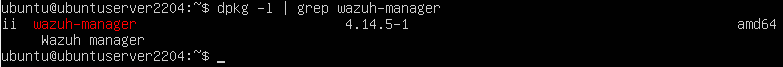
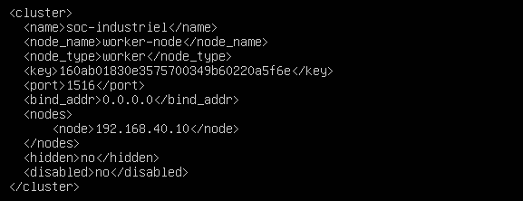
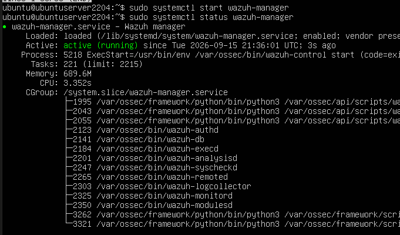
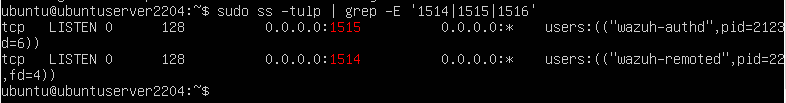
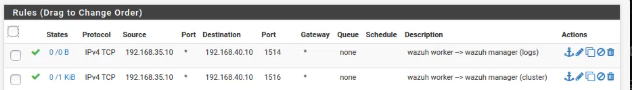
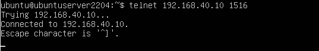

# Wazuh Worker Configuration — Industrial DMZ (Level 3.5)

This document describes the deployment and cluster configuration of the **Wazuh Worker** node, hosted alongside Guacamole on the industrial DMZ server.

---

## 1. Overview

The **Wazuh Worker** sits at **Level 3.5 (Industrial DMZ)** of the Purdue model, on the `dmz-net` segment, sharing the DMZ server with Guacamole. It is the **collection point for OT-side agents** (OpenPLC, ScadaBR, engineering workstation): agents on the OT segments send their logs and events to the Worker, which then relays them to the Wazuh Manager on the Enterprise Network. This keeps OT hosts from ever needing a direct network path to the Enterprise Network.

| Parameter | Value |
|-----------|-------|
| Role | Wazuh cluster worker node + agent collection point |
| Purdue level | Level 3.5 (Industrial DMZ) |
| Segment | dmz-net |
| IP address | 192.168.35.10/24 |
| Gateway | 192.168.35.1 (pfSense em3) |
| Shares host with | Apache Guacamole |

---

## 2. Installation

*Figure — Wazuh Worker installation and version check*

---

## 3. Cluster Configuration (Worker Node)

The cluster block in `/var/ossec/etc/ossec.conf` defines this node as a **worker** of the Wazuh cluster. It must use the **same cluster name and key** as the Manager, with a unique `node_name`.

*Figure — `/var/ossec/etc/ossec.conf`: cluster configuration (node_type: worker)*

**Table — Cluster parameters (Worker)**

| Parameter | Value |
|-----------|-------|
| node_type | worker |
| node_name | worker-node |
| disabled | no |
| key | (shared cluster key, identical on Manager) |

---

## 4. Service Status and Listening Ports

The Worker must be running and listening on the same set of ports as the Manager, since it also receives connections from OT agents (1514/1515) in addition to the cluster link (1516) toward the Manager.

*Figure — `systemctl status wazuh-manager` on the Worker*

*Figure — `ss -tulnp` on the Worker showing ports 1514, 1515, and 1516 in LISTEN state*

---

## 5. Firewall Rules — Worker to Manager

To let the Worker relay logs and cluster traffic to the Manager, pfSense rules were added on the **DMZ** interface, authorizing traffic from the Worker's address (`192.168.35.10`) to the Manager (`192.168.40.10`) on the required ports.

*Figure — pfSense: DMZ interface rules for ports 1514 (logs) and 1516 (cluster) toward the Manager*

**Table — Firewall rules: DMZ interface (Worker → Manager)**

| Protocol | Source | Destination | Port | Description |
|----------|--------|-------------|------|-------------|
| IPv4 TCP | 192.168.35.10 | 192.168.40.10 | 1514 | Wazuh worker → Wazuh manager (logs) |
| IPv4 TCP | 192.168.35.10 | 192.168.40.10 | 1516 | Wazuh worker → Wazuh manager (cluster) |

---

## 6. Connectivity Test to the Manager

A `telnet`/`ping` test from the Worker toward the Manager on the cluster port confirms the link is functional end to end.

*Figure — Successful `telnet 192.168.40.10 1516` from the Worker*

---

## 7. Notes

- If the Worker (or Manager) VM is restarted and the cluster shows as **KO** afterward, check first that pfSense still shows traffic on the DMZ rules above, then confirm the Manager's static IP actually came back up after reboot — see `TROUBLESHOOTING.md` for the full incident encountered on this lab.
