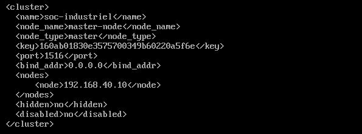
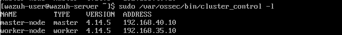

# Wazuh Manager Configuration — Enterprise Network (Level 4/5)

This document describes the deployment and cluster configuration of the **Wazuh Manager** (master node) on the Enterprise Network of the industrial SOC lab.

---

## 1. Overview

The **Wazuh Manager** sits at **Level 4/5 (Enterprise Network)** of the Purdue model, on the `soc-net` segment. It acts as the **master node** of the Wazuh cluster, receiving correlated logs and alerts relayed by the **Wazuh Worker** (deployed in the DMZ) and providing the central dashboard for SOC analysts.

| Parameter | Value |
|-----------|-------|
| Role | Wazuh cluster master node |
| Purdue level | Level 4/5 (Enterprise Network) |
| Segment | soc-net |
| IP address | 192.168.40.10/24 |
| Gateway | 192.168.40.1 (pfSense em4) |

---

## 2. Installation

*Figure — Wazuh Manager installation and version check*

---

## 3. Cluster Configuration (Master Node)

The cluster block in `/var/ossec/etc/ossec.conf` defines this node as the **master** of the Wazuh cluster. The cluster `<key>` must be identical on every node (Manager and Worker) — it is what authenticates nodes to each other.

*Figure — `/var/ossec/etc/ossec.conf`: cluster configuration (node_type: master)*

**Table — Cluster parameters (Manager)**

| Parameter | Value |
|-----------|-------|
| node_type | master |
| node_name | master-node |
| disabled | no |
| key | (shared cluster key, identical on Worker) |

---

## 4. Service Status and Listening Ports

The Manager must be actively running and listening on the ports used for agent communication (1514), agent enrollment (1515), and cluster communication (1516).

*Figure — `systemctl status wazuh-manager`*

*Figure — `ss -tulnp` showing ports 1514, 1515, and 1516 in LISTEN state*

---

## 5. Cluster Status Verification

Once the Worker node is configured and connected, `cluster_control -l` on the Manager lists every node in the cluster along with its role and version.

*Figure — `/var/ossec/bin/cluster_control -l`: master-node and worker-node both connected*

---

## 6. Notes

- The Manager's network interface must keep a **static IP** across reboots. On this host (no NetworkManager, legacy `ifcfg-eth0`), a VM restart can leave `eth0` without an IPv4 address until the interface is brought back up manually (`ifdown eth0 && ifup eth0`) — see `TROUBLESHOOTING.md` for the full incident.
